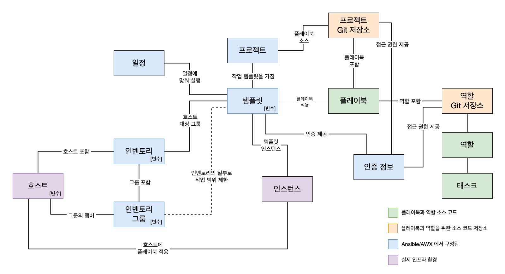

#. 1 AWX 웹 리소스



## 1.1 AWX 인스턴스

`awx.yaml`

```yaml
apiVersion: awx.ansible.com/v1beta1
kind: AWX
metadata:
  name: awx
spec:
  service_type: nodeport
```

## 1.2 AWX 웹 접속

- URL: `http://localhost:<assigned-nodeport>`
- ID: admin
- Password: 아래 명령어로 확인
```bash
kubectl get secret -n awx awx-admin-password -o jsonpath="{.data.password}" | base64 --decode ; echo
```

## 1.3 리소스 설정

### 1.3.1 인증 정보
- 이름: awx-np
- 조직: Default
- 인증 정보 유형: OpensShift 또는 Kubernetes API 전달자 토큰
- API 끝점 설정: `https://kubernetes.defaults`


- API 인증 전달자 토큰:
	- awx 서비스 계정에 클러스터 관리자 권한 부여
	```bash
	kubectl create clusterrolebinding awx-admin --clusterrole=cluster-admin --serviceaccount=awx:awx
	```kubectl get po
	
	- 기존 awx 서비스 계정 토큰 생성
	```bash
	kubectl create token awx -n awx --duration=2400h
	```

	```bash
	eyJhbGciOiJSUz........
	```
	
- CA 인증서: `kubectl config view`로 확인된 `ca.crt` 파일 내용
	- ex) `/Users/UserName/.minikube/ca.crt`
- SSL 확인: 체크 해제

### 1.3.2 프로젝트 설정

- 이름: awx-np_project
- 조직: Default
- 소스 제어 유형: git
- 소스 제어 URL: 플레이북이 있는 깃허브 저장소

`awx-np.yaml`

```yaml
---
- name: Simple Nginx Pod Test
  hosts: localhost
  connection: local
  gather_facts: no
  tasks:
    - name: Create nginx pod
      kubernetes.core.k8s:
        state: present
        definition:
          apiVersion: v1
          kind: Pod
          metadata:
            name: awx-np-nginx
            namespace: default
          spec:
            containers:
            - name: nginx
              image: nginx:latest
              ports:
              - containerPort: 80

    - name: Check pod status
      kubernetes.core.k8s_info:
        kind: Pod
        name: awx-np-nginx
        namespace: default
      register: pod_info
```

### 1.3.3 인벤토리 설정
- 이름: awx-np_inventory
- 조직: Default

### 1.3.4 작업 템플릿 설정
- 이름: awx-np_template
- 작업 유형: 실행
- 인벤토리: awx-np_inventory
- 프로젝트: awx-np_project
- 실행 환경: AWX EE(24.6.1)
- Playbook: awx-np.yaml

## 1.4 실행 및 확인

### 1.4.1 템플릿 실행

`awx-np_template`

### 1.4.2 결과 확인

`kubectl get po`

```
NAME         READY   STATUS    RESTARTS   AGE
awx-np-nginx   1/1     Running   0          19m
```

### 1.4.3 포트포워딩 설정

```bash
kubectl port-forward pod/awx-np-nginx 8080:80
```

### 1.4.4 브라우저에서 확인

```bash
http://localhost:8080
```
